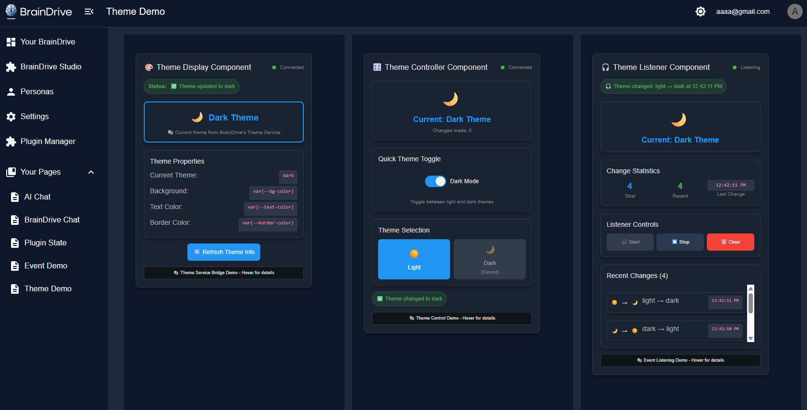

> ⚠️ **This repository has been archived.** BrainDrive has evolved into the [Personal AI Architecture](https://personalaiarchitecture.org) — an MIT-licensed, open architecture for building personal AI systems with zero lock-in. See the [new repo](https://github.com/Personal-AI-Architecture/the-architecture) for the latest work.

---

# ServiceExample_Theme - BrainDrive Theme Service Bridge Demo

A working demonstration plugin for BrainDrive's Theme Service Bridge functionality. This plugin showcases real-time theme management within the BrainDrive platform through three interactive components that display, control, and monitor theme changes.

## 📸 Plugin Demo



*The ServiceExample_Theme plugin in action, showing real-time theme management through the Theme Display, Theme Controller, and Theme Listener modules.*

## 🎯 Purpose

This plugin serves as a **working demo** of BrainDrive's Theme Service Bridge, demonstrating:
- How modules interact with BrainDrive's theme system
- Real-time theme change detection and response
- Theme Service Bridge integration patterns
- Best practices for theme-aware plugin development in BrainDrive

## 📦 What's Included

### Three Demo Modules

1. **Theme Display** - Show current theme information and service status
2. **Theme Controller** - Interactive theme switching controls
3. **Theme Listener** - Monitor and log theme changes in real-time

### Theme Service Bridge Integration
- Complete Theme Service wrapper implementation
- Proper service bridge connection handling
- Real-time theme change listening and response
- Theme-aware styling patterns

## 🚀 Installation & Usage

### Prerequisites
- BrainDrive platform (this plugin runs inside BrainDrive)
- Plugin Manager access in BrainDrive

### Installation
1. Install the plugin through BrainDrive's Plugin Manager
2. The plugin will be available in your module library

### Usage in BrainDrive
1. **Create a new page** in BrainDrive
2. **Add the demo modules** to your page:
   - Drag "Theme Display" module to the page
   - Drag "Theme Controller" module to the page
   - Drag "Theme Listener" module to the page
3. **Test the theme management**:
   - View current theme information in Theme Display
   - Use Theme Controller to switch between light and dark themes
   - Watch real-time theme change events in Theme Listener
   - Notice how all modules automatically adapt their styling

## 🔧 Demo Features

### Theme Display Module
- **Current Theme Info**: Shows active theme (light/dark)
- **Service Status**: Visual connection indicator
- **Theme Properties**: Displays CSS variables and theme metadata
- **Refresh Function**: Manual theme information refresh
- **Real-time Updates**: Automatically updates when theme changes

### Theme Controller Module
- **Theme Toggle**: Quick light/dark theme switch
- **Theme Selection**: Individual theme buttons
- **Change Tracking**: Counts theme changes made
- **Status Feedback**: Shows operation results and errors
- **Theme Sync**: Automatically reflects current theme state

### Theme Listener Module
- **Event Monitoring**: Logs all theme change events
- **Change History**: Tracks recent theme transitions with timestamps
- **Statistics**: Shows total changes and activity metrics
- **Listener Controls**: Start/stop/clear functionality
- **Real-time Sync**: Syncs with current theme when starting

## 🎨 Theme Service Bridge Demo

This plugin demonstrates key Theme Service Bridge concepts:

### Service Integration
```typescript
// How the Theme Service Bridge is initialized
if (this.props.services?.theme) {
  const currentTheme = this.props.services.theme.getCurrentTheme();
}
```

### Theme Reading
```typescript
// Get current theme
const currentTheme = this.props.services.theme.getCurrentTheme();
console.log('Current theme:', currentTheme); // 'light' or 'dark'
```

### Theme Changing
```typescript
// Change theme (if supported)
if ('setTheme' in this.props.services.theme) {
  this.props.services.theme.setTheme('dark');
}
```

### Theme Change Listening
```typescript
// Listen for theme changes
this.themeChangeListener = (newTheme) => {
  console.log('Theme changed to:', newTheme);
  this.setState({ currentTheme: newTheme });
};
this.props.services.theme.addThemeChangeListener(this.themeChangeListener);
```

## 🎓 Learning Objectives

After using this demo, developers will understand:
- How BrainDrive's Theme Service Bridge works
- Patterns for theme-aware plugin development
- Theme change detection and response in BrainDrive
- Service bridge integration best practices
- CSS variable patterns for automatic theme adaptation

## 🧪 Testing the Demo

### Basic Test Flow
1. Place all three modules on a BrainDrive page
2. Use Theme Controller to switch from light to dark theme
3. Watch Theme Display automatically update to show new theme
4. Check Theme Listener to see the change event was logged
5. Notice how all module styling automatically adapts

### Advanced Testing
- Test theme switching with multiple modules on the same page
- Monitor connection status indicators across modules
- Test listener start/stop functionality
- Observe theme synchronization when starting listeners
- Test error handling by checking console logs

## 🔍 Technical Implementation

### Module Federation Architecture
- Class-based React components for BrainDrive compatibility
- Proper webpack configuration for plugin loading
- Service bridge integration following BrainDrive patterns

### Theme-Aware Styling
```typescript
// Automatic theme adaptation
<div className={`${currentTheme === 'dark' ? 'dark-theme' : ''}`}>
  {/* Content automatically adapts via CSS variables */}
</div>
```

### CSS Variable System
```css
/* Light theme variables */
:root {
  --bg-color: #ffffff;
  --text-color: #333333;
  --border-color: rgba(0, 0, 0, 0.2);
}

/* Dark theme variables */
.dark-theme {
  --bg-color: #121a28;
  --text-color: #e0e0e0;
  --border-color: rgba(255, 255, 255, 0.1);
}
```

### Component Lifecycle
- Proper service bridge initialization
- Theme change listener management
- Cleanup on component unmount

## 🛠️ For Developers

This plugin serves as a **reference implementation** for:
- Theme Service Bridge integration
- Theme-aware component development
- BrainDrive plugin architecture
- Service bridge connection handling

### Key Files
- `src/services/themeService.ts` - Theme Service Bridge wrapper
- `src/components/ThemeDisplay.tsx` - Theme information display component
- `src/components/ThemeController.tsx` - Theme switching component
- `src/components/ThemeListener.tsx` - Theme change monitoring component
- `src/styles/theme-example.css` - Theme-aware CSS variables and styling

## 📋 Requirements

- **BrainDrive Platform**: This plugin must run inside BrainDrive
- **Theme Service**: Requires BrainDrive's Theme Service to be available
- **Module Support**: Page must support multiple modules for full demo

## 🆘 Troubleshooting

### Common Issues
- **No theme changes detected**: Ensure Theme Service is available in BrainDrive
- **Styling not adapting**: Check that CSS variables are properly configured
- **Connection issues**: Verify Theme Service Bridge is properly initialized

### Debug Tips
- Check browser console for Theme Service logs
- Use Theme Listener module to monitor all theme activity
- Verify service connection status in Theme Display module
- Look for educational "📚 LEARNING:" messages in console

## 📚 Related Links

- [BrainDrive](https://github.com/BrainDriveAI/BrainDrive)
- [Service Bridge - Theme Developers Guide](DEVELOPER_GUIDE.md)
- [Error Handling Guide](ERROR_HANDLING_GUIDE.md)

---

**Experience BrainDrive's Theme Service Bridge in Action! 🎨**

*This is a demonstration plugin designed to run within the BrainDrive platform. It showcases real-time theme management and theme-aware development capabilities.*